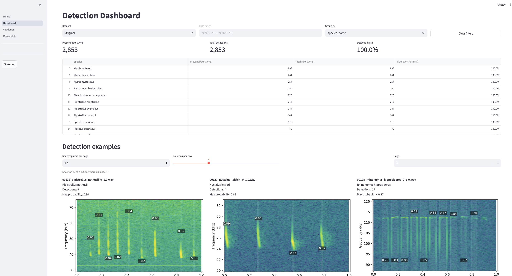

# Dashboard

The Detection Dashboard gives you a high-level view of your project and a quick way to explore detections before you start validating.

{ width="1100" }

## What you can do on the Dashboard

PAMalytics provides:

- Headline stats (total detections, total recordings, detection rate)
- Global date range and recorder filters (AND logic)
- Location stats table (counts and rates)
- Interactive map sized by detections per recorder
- Detections over time and by time of day
- Validation grid: spectrogram thumbnails and audio playback

## Explore your detections

When you launch a PAMalytics project you’ll land on the Detection Dashboard. Use it to get an overview of your data and run basic analytics without leaving the app.

At the top of the page you can:

- set a **date range** using the date picker
- choose a **grouping variable** (for example species, site, or any other metadata column you imported)

The grouping variable controls how summaries and charts are broken down across the dashboard.

If you imported `lat/lon` and/or `date_time` metadata, the dashboard will automatically populate:

- an **interactive map** showing detections geographically
- a **detections over time** chart
- an **intra-day detections** chart (time-of-day pattern)

All of these views are separated by your selected grouping variable (e.g. species or site).

## Preview audio and spectrograms

You can inspect detections directly from the dashboard using the validation grid.

Each spectrogram thumbnail is annotated to help you triage quickly:

- the predicted label (e.g. species)
- the number of detections found
- detection markers overlaid on the spectrogram, coloured/positioned by detector confidence (as provided by your classifier)

Use the audio playback alongside the spectrograms to confirm detections before moving into full validation.
