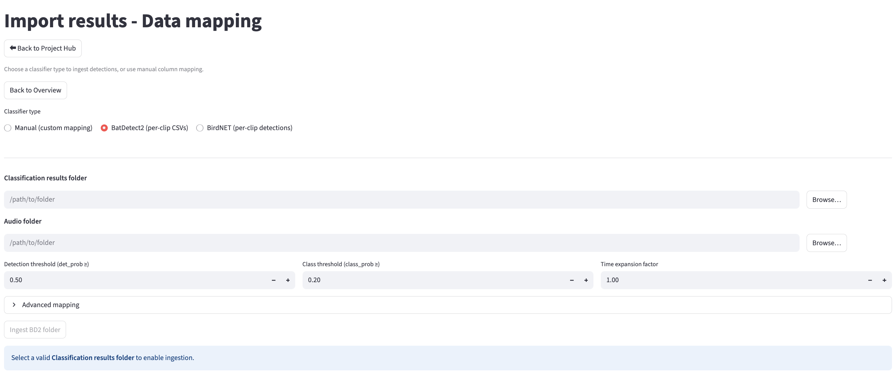
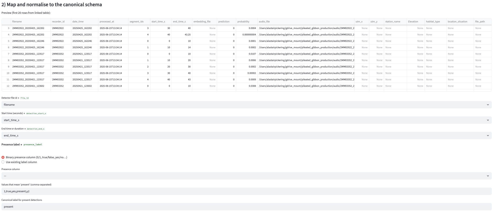

# Set up your first project

When you log in for the first time, you’ll land on the Project Dashboard and be prompted to create your first project.

Enter a project name and select **Create project**. PAMalytics will open the project overview, where you can complete **Data mapping** and, optionally, **Metadata mapping** before launching the dashboard.

## Choose your mapping method

Open **Data mapping** and choose one of three ingestion routes:

- **BirdNET**
- **BatDetect2**
- **Manual mapping** for any other classifier output

For all three routes, you can select either individual files or folders containing multiple files.

## Using a pre-built adapter

Select the relevant adapter, then:

- choose the classifier detection file or folder;
- choose the audio file or folder;
- review the available classifier-specific settings;
- start the ingestion.

For large audio stores, PAMalytics saves an SQLite audio index during ingestion. When a later project or run uses the same large file store, such as research data storage (RDS), open **Advanced options**, select **Use an existing saved audio index**, and choose the SQLite index created previously. This avoids scanning the full audio store again.

Create a new index when the audio store has changed, for example when files have been added, removed, renamed or moved.

After ingestion, PAMalytics shows the number of detections imported and the percentage linked to audio. Check these figures before continuing.

## Manual mapping for other classifiers

Choose **Manual mapping** when your classifier is not supported by a pre-built adapter.

Manual mapping links your source columns to the PAMalytics schema while retaining additional columns for later analysis.

### Link detections to audio files

Select the detection file or folder and the audio file or folder.

Confirm which source column identifies the recording file. This can be a filename or file path. PAMalytics uses it to link each detection to its corresponding audio file.

For a large audio store that has already been indexed, open **Advanced options**, select **Use an existing saved audio index**, and choose the saved SQLite index.

Review the matched, unmatched and ambiguous totals before continuing. A low or unexpected match rate usually indicates that the selected identifier does not match the available audio paths or filenames. Download the ambiguous-matches CSV where needed, correct the source information, and rerun the mapping before final ingestion.

### Map detection columns to the PAMalytics schema

Map the required fields, including:

- recording file identifier;
- detection start and end times;
- species or class label;
- presence label;
- detection probability or confidence, where available.

PAMalytics suggests likely mappings. Review each suggestion and change it where necessary.

Confirm the mapping and review the normalised detection preview before returning to the project overview. Additional source columns are retained for downstream use.

## How PAMalytics matches detections to audio

Before final ingestion, PAMalytics attempts to link each detection to an audio file.

It first checks whether the detection data contain a named file path that points to an available audio file. When no valid path is found, PAMalytics then tries to match the detection filename against the selected audio store.

A filename is linked only when there is one clear one-to-one match:

- if exactly one audio file has that filename, the detection is linked to it;
- if more than one audio file shares the same filename, the match is treated as ambiguous and is not linked automatically;
- if no matching audio file is found, the detection remains unmatched.

Before final ingestion, PAMalytics summarises:

- how many detections were matched to audio;
- how many were unmatched;
- how many filename matches were ambiguous.

You can download a CSV containing the ambiguous matches, correct the relevant file paths or filenames, and rerun the mapping before finalising ingestion.

## Add metadata

From the project overview, open **Metadata mapping** to join optional information such as recorder, site, date, time or location.

Metadata mapping can also be skipped and completed later.

## Launch PAMalytics

The project overview shows:

- the number of imported detections;
- the number and percentage linked to audio;
- whether metadata mapping is complete or has been skipped.

Once Data mapping is complete, select **Launch** to open the Detection Dashboard.
