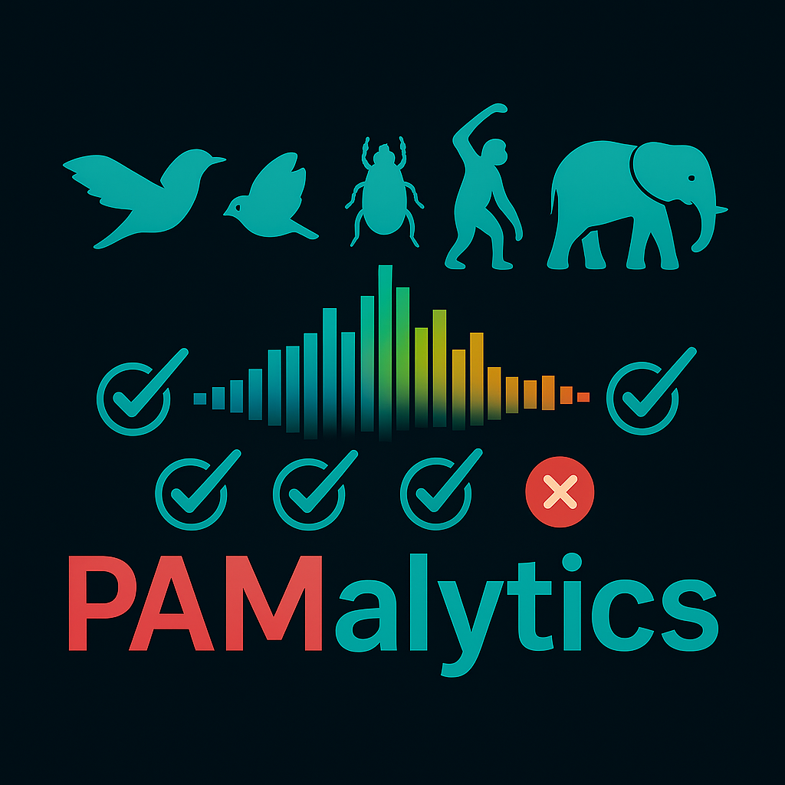

  
  

    <h1>PAMalytics</h1>
    

      A no-code application for validating bioacoustic detections.
    

    

      <a href="quick-start/">Quick start</a> ·
      <a href="first-project/">Set up your first project</a> ·
      <a href="validate/">Validate</a>
    

  

[Download PAMalytics](https://github.com/AlastairPickering/PAMalytics/releases/latest){ .md-button .md-button--primary }
[Quick start](quick-start.md){ .md-button }

## What it does

PAMalytics lets you:

- Review detections using spectrograms and audio playback
- Create a targeted sample for validation
- Confirm detections, change species labels, or mark them absent or uncertain
- Track validation progress and classifier performance
- Keep original classifier outputs alongside review decisions
- Export validated results for downstream analysis

## Start here

Choose what you want to do:

- Set up your first project: [Set up your first project](first-project.md)
- Explore detections: [Dashboard](dashboard.md)
- Validate detections: [Validate](validate.md)
- Model threshold impacts: [Recalculate](recalculate.md)

Prefer video? Watch it on the [Quick start](quick-start.md) page.