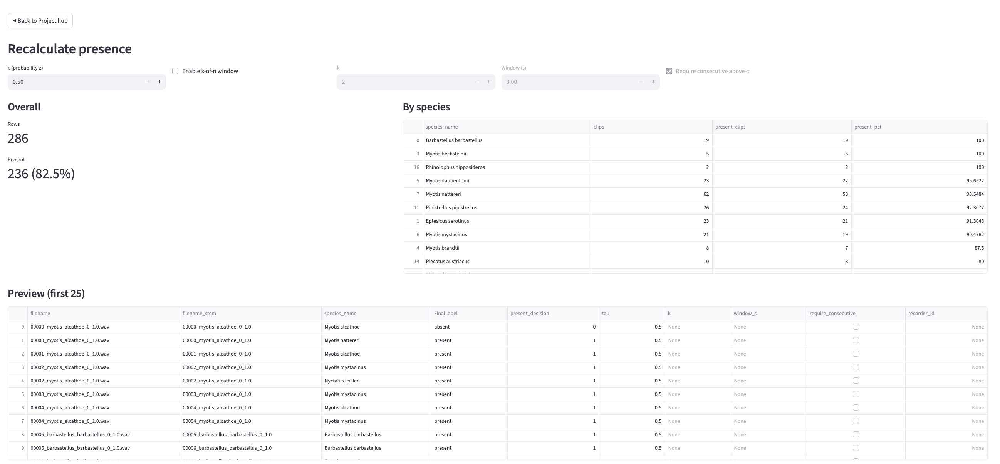

# Recalculate

The Recalculate page shows how different summary rules affect the number and composition of detections retained as present. It lets you compare alternative confidence thresholds and presence rules without rerunning the classifier.

{ width="1100" }

## What Recalculate does

Recalculate applies alternative rules to the detections already imported into PAMalytics. As you adjust the settings, PAMalytics:

- recalculates the **total number of detections**
- recomputes the **breakdown by your chosen grouping variable** (for example species, site, or any other metadata)

## Ways to adjust classification rules

There are two main approaches.

### Adjust the presence threshold

You can change the confidence threshold used to classify a detection as **present**, relative to the default of **0.5**.

In general:

- higher thresholds reduce the number of detections (often reducing false positives)
- lower thresholds increase the number of detections (often reducing false negatives, but increasing review load)

### Apply a *k-of-n* presence rule

You can also apply a *k-of-n* rule, which requires at least *k* present detections within *n* consecutive audio windows.

For example, a **2 of 5** rule means a detection is only included if there are at least **2 classifier detections** within **5 consecutive audio files**.

This is especially helpful for taxa with longer calling patterns, where genuine presence is more likely to appear across neighbouring recordings rather than as isolated single detections.

When you apply a *k-of-n* rule, PAMalytics recalculates totals and group-level breakdowns using the updated rule.

## Interpreting the results

Recalculate shows how many detections would be retained under the selected rules, both overall and by the chosen grouping variable. It does not directly calculate precision, recall or false-positive rate.

Changing these settings does not alter the original classifier output or rerun the classifier.
