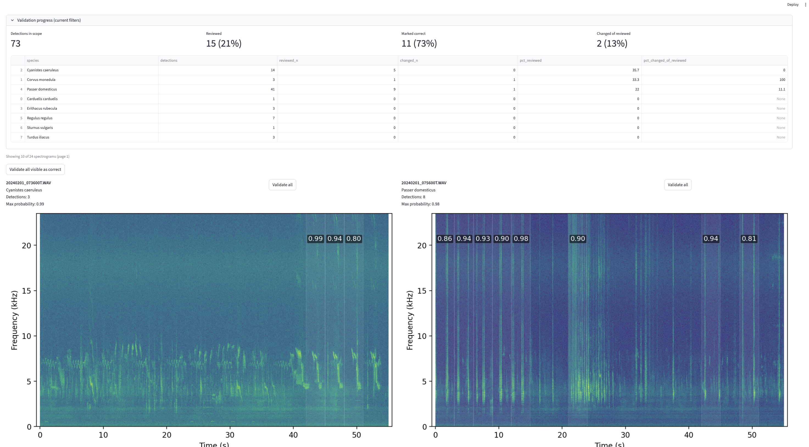

# Validate

{ width="1100" }
{ width="1100" }

Validation is designed for fast review:
- track what proportion of clips have been validated by site x species
- monitor classifier accuracy
- sort and filter by clip probability (min–max segment probability per file)
- high-resolution spectrograms for quick visual checks
- audio playback with automated time expansion for ultrasonic calls
- shows pending changes before saving
